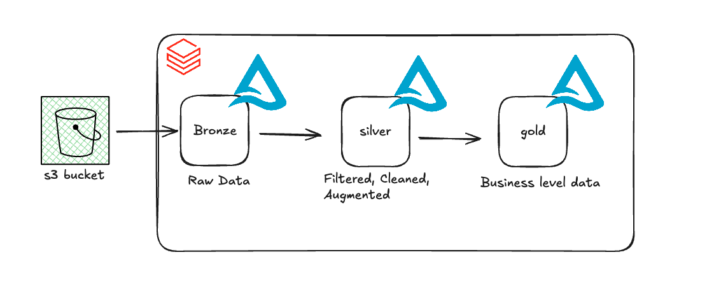
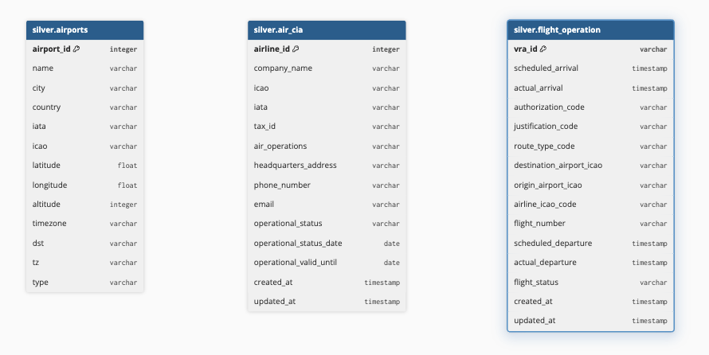
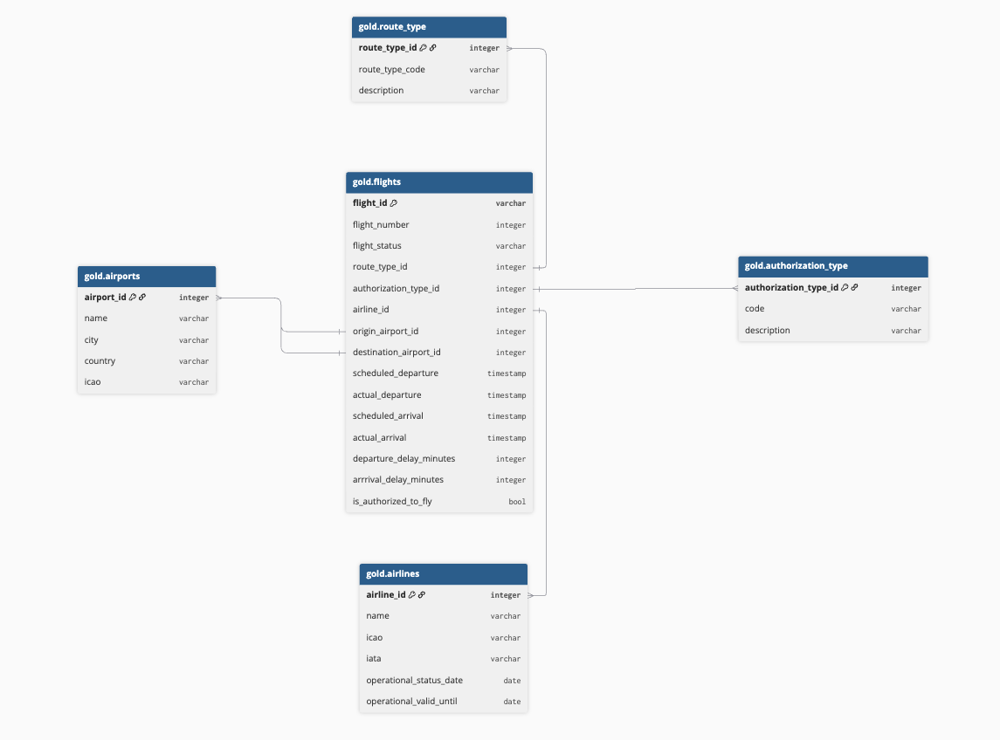

# Data Modeling

## 1. Overview
### Objective
This project aims to process, transform, and make data available for analytics and consumption by analytical applications through a Lakehouse architecture implemented on Databricks.

The architecture follows a medallion structure approach:
- S3 (Staging)
- Bronze
- Silver
- Gold

Each layer has specific responsibilities to ensure data governance, quality, and traceability throughout the data lifecycle.

## 2 - Architecture


## 3. Project Layers
### 3.1 Staging (Amazon S3)
#### Objective
This layer is responsible for the initial storage of files received from data sources.

#### Characteristics
* Data is stored in its raw format.
* No business transformations are applied.
* Serves as the entry point for incoming data.
* Maintains a historical record of all received files.

#### Responsibilities
* Receive data from source systems.
* Ensure data traceability.
* Serve as a recovery layer in case of processing failures.

### 3.2 Bronze Layer

#### Objective

Persist data exactly as it is received from the Staging layer, preserving the original structure and content of the source data.

#### Characteristics

* Data stored in Delta Lake format.
* Schema closely aligned with the source systems.
* Minimal or no business transformations applied.
* Inclusion of technical and audit-related columns.

#### Applied Transformations

* Conversion of source files into Delta format.
* Addition of metadata fields, including:

  * `_source_file`
  * `_ingestion_date`
  * `created_at`
  * `updated_at`

### 3.3 Silver Layer
#### Objective

Provide clean, standardized, and business-ready data prepared for analytical modeling and downstream consumption.

#### Characteristics

* Cleansed and transformed data.
* Application of data quality rules.
* Standardized and normalized data structures.



#### Applied Transformations
##### Data Cleansing

* Removal of invalid records.
* Null value handling.
* Standardization of data formats.

##### Data Quality
* Data type validation.
* Deduplication of records.
* Enforcement of business rules.

### 3.4 Gold Layer
#### Objective

Provide data models optimized for business analytics, reporting, and key performance indicators (KPIs).

#### Characteristics
Consumption-oriented data structures.
Aggregated tables.
Business metrics and KPIs.
Data Modeling

The Gold layer leverages dimensional modeling to optimize analytical queries and support efficient reporting and business intelligence workloads.



## 4. Data Modeling

### Modeling Trade-offs: Star Schema vs Snowflake Schema vs One Big Table

During the design of the Gold layer, three common analytical modeling approaches were evaluated:

1. Star Schema
2. Snowflake Schema
3. One Big Table (OBT)

The following section summarizes the trade-offs between these approaches and explains why Star Schema was selected.

### Comparison

| Criteria              | Star Schema | Snowflake Schema | One Big Table (OBT) |
| --------------------- | ----------- | ---------------- | ------------------- |
| Query Simplicity      | High        | Medium           | Very High           |
| Number of Joins       | Medium      | High             | None                |
| Storage Efficiency    | Medium      | High             | Low                 |
| Data Redundancy       | Medium      | Low              | High                |
| ETL Complexity        | Medium      | High             | Low                 |
| Business Usability    | High        | Medium           | High                |
| Scalability           | High        | High             | Medium              |
| Historical Tracking   | Medium      | Medium           | Difficult           |
| BI Tool Compatibility | Excellent   | Good             | Excellent           |

## Star Schema

### Advantages

* Easy for analysts and business users to understand.
* Well-supported by BI tools.
* Reduces data duplication compared to flat tables.
* Good balance between performance and maintainability.
* Scales well as new dimensions are added.

### Limitations

* Queries require joins between fact and dimension tables.
* ETL pipelines must resolve surrogate keys.
* Historical tracking requires additional patterns such as SCD Type 2.
* Large fact tables may become expensive to maintain over time.

## Snowflake Schema

Snowflake Schema extends Star Schema by further normalizing dimensions.

Example:

```text
Airports
    └── Countries
           └── Regions
```

### Advantages

* Reduced data duplication.
* Better data consistency.
* Lower storage consumption.

### Limitations

* Increased number of joins.
* More complex queries.
* Harder for business users to understand.
* Query performance may degrade due to deep join chains.

For aviation analytics, Snowflake Schema would introduce additional complexity without providing significant business value.

## One Big Table (OBT)

A One Big Table approach stores all information in a single denormalized table.

Example:

```text
flight_id
flight_number
airline_name
airline_icao
origin_airport_name
origin_city
destination_airport_name
destination_city
route_type
authorization_type
...
```

### Advantages

* No joins required.
* Extremely simple queries.
* Excellent performance for dashboard workloads.
* Easy for analysts to consume.

Example:

```sql
SELECT
    airline_name,
    COUNT(*)
FROM flights_obt
GROUP BY airline_name;
```

### Limitations

* High data duplication.
* Increased storage costs.
* Difficult maintenance when business attributes change.
* Data quality issues can propagate across millions of rows.
* Historical corrections require expensive updates.

For example, if an airline changes its name, every related flight record may need to be updated.

## Handling Time-Based Data and Joins

One common criticism of Star Schema is the growing complexity of joins and historical data management.

### What OBT Solves

A One Big Table eliminates joins by precomputing and storing all business attributes in a single dataset.

Benefits:

* Faster dashboard queries.
* Simpler SQL.
* Better user experience for self-service analytics.

### What OBT Does Not Solve

OBT introduces challenges for historical data:

* Airline attribute changes affect many rows.
* Airport metadata corrections require large updates.
* Storage grows significantly over time.

As datasets grow, maintaining consistency becomes increasingly difficult.

## Why Star Schema Was Selected

The Gold layer prioritizes:

* Data consistency.
* Analytical flexibility.
* Maintainability.
* Scalability.

While OBT provides simpler queries, the increase in data redundancy and maintenance costs outweighs its benefits for this project.

Star Schema offers a balanced approach, providing efficient analytics while preserving data quality and governance.

For large-scale analytics platforms, a common strategy is to maintain Star Schema as the source of truth and create OBTs or aggregated tables for specific dashboard use cases when query performance becomes a concern.
